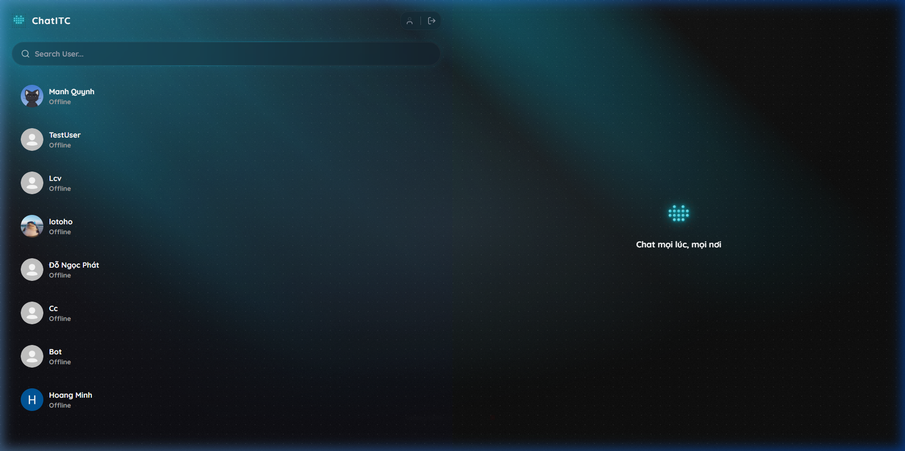
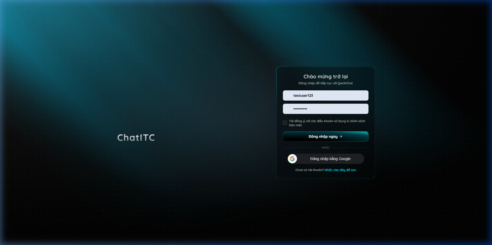

<div align="center">
  <br />
  <a href="#">
    
  </a>

  <h1 align="center">ChatApp (Realtime MERN Chat App)</h1>

  <p align="center">
    Một siêu ứng dụng nhắn tin thời gian thực đa nền tảng, thiết kế theo phong cách Glassmorphism tuyệt đẹp, tích hợp cuộc gọi Video ngang hàng (P2P), truyền tệp đa phương tiện, và hệ thống thao tác cảm ứng tối ưu.
    <br />
    <br />
    <a href="#usage"><strong>Khám phá tài liệu »</strong></a>
    <br />
    <br />
    <a href="#">Xem Demo</a>
    ·
    <a href="#">Báo cáo Lỗi</a>
    ·
    <a href="#">Yêu cầu Tính năng</a>
  </p>
</div>

<div align="center">
  
  
  
  
  
  
  
  
  
  
</div>

<br />

<div align="center">
  
  <br /><br />
  
</div>

<br />

---

<details>
  <summary><h2>Mục lục (Table of Contents)</h2></summary>
  <ol>
    <li><a href="#about-the-project">Về Dự Án</a></li>
    <li><a href="#built-with">Công Nghệ Sử Dụng</a></li>
    <li><a href="#key-features">Các Tính Năng Chính</a></li>
    <li>
      <a href="#getting-started">Hướng Dẫn Cài Đặt</a>
      <ul>
        <li><a href="#prerequisites">Điều Kiện Kiên Quyết</a></li>
        <li><a href="#installation">Cài Đặt</a></li>
      </ul>
    </li>
    <li><a href="#usage">Cách Sử Dụng</a></li>
    <li><a href="#roadmap">Định Hướng Phát Triển (Roadmap)</a></li>
    <li><a href="#contributing">Đóng Góp</a></li>
    <li><a href="#license">Giấy Phép</a></li>
    <li><a href="#contact">Liên Hệ</a></li>
  </ol>
</details>

---

## About The Project (Về Dự Án)

**ChatApp** không chỉ là một ứng dụng nhắn tin thông thường, mà còn là một nền tảng giao tiếp toàn diện được xây dựng từ đầu (from scratch) nhằm cung cấp trải nghiệm mượt mà, bảo mật và thân thiện với người dùng. 

Điểm nhấn lớn nhất của dự án nằm ở **giao diện UI/UX được chau chuốt cực kỳ kĩ lưỡng** với tông màu Dark Mode sang trọng, kết hợp hiệu ứng kính mờ (Glassmorphism) và các Animation linh hoạt. Dự án còn chú trọng trải nghiệm di động (Mobile-first) với thuật toán cuộn thông minh (Smart Auto-Scroll), hỗ trợ haptic feedback và các thao tác nhấn giữ (Long-press) mượt mà như ứng dụng gốc (Native).

---

## Built With (Công Nghệ Sử Dụng)

Ứng dụng được phân tách thành hai kiến trúc độc lập Client (Frontend) và Server (Backend):

*  **React 18**
*  **Vite** (Build Tool)
*  **Tailwind CSS 4** (UI Styling)
*  **Framer Motion & GSAP** (Animations)
*  **Node.js & Express**
*  **MongoDB & Mongoose**
*  **Socket.IO** (Real-time Messaging & Relay)
*  **WebRTC (Simple-Peer)** (P2P Video Call)

Các dịch vụ và tiện ích bổ sung:
* **Metered.ca:** Cung cấp hệ thống máy chủ **STUN/TURN Server** chất lượng cao, giúp định tuyến hình ảnh, vượt màng lọc NAT/Tường lửa để thiết lập Video Call (WebRTC) thành công ở mọi loại mạng (4G, Wifi công cộng).
* **Cloudinary:** Dịch vụ lưu trữ đám mây (CDN) để tải lên, lưu trữ và nén ảnh, tệp tin, tập tin Zip tốc độ cao.
* **Google OAuth 2.0:** Giao thức xác thực an toàn thông qua thư viện `google-auth-library` và `@react-oauth/google`.
* **JWT (JSON Web Tokens):** Quản lý phiên đăng nhập và bảo mật các API thông qua HttpOnly Cookie.
* **Lucide-React:** Bộ thư viện Icon SVG gọn nhẹ và tinh tế.

---

## Key Features (Tính Năng Chính)

- **Nhắn tin Thời gian thực**: Giao tiếp tốc độ ánh sáng thông qua Socket.IO. Hỗ trợ hiển thị trạng thái đang hoạt động và "Đã xem" (Read Receipts).
- **Trải nghiệm UX Di Động**: Menu tùy chọn (3 chấm), nhấn giữ (Long-press) để thả biểu tượng cảm xúc, Layout h-[100dvh] không lỗi tràn viền trên mobile.
- **Tính năng Trò Chuyện**: Chỉnh sửa tin nhắn (Edit), thu hồi tin nhắn (Revoke), phản hồi (Reaction).
- **Gọi Video Trực Tuyến**: Thiết lập WebRTC Peer-to-Peer, hỗ trợ qua STUN/TURN Server chuyên dụng để vượt tường lửa, hiển thị bong bóng lịch sử cuộc gọi.
- **Truyền Tệp Tin Nâng Cao**: Hỗ trợ gửi ảnh, tài liệu và đặc biệt nén toàn bộ thư mục (Zip Folder) trước khi gửi thông qua Cloudinary.
- **Xác thực An toàn**: Đăng ký, Đăng nhập (với JWT), tích hợp Google OAuth 2.0.

---

## Getting Started (Hướng Dẫn Cài Đặt)

Làm theo các bước dưới đây để sao chép (clone) dự án và chạy trên máy tính (local) của bạn.

### Prerequisites
Hãy đảm bảo bạn đã cài đặt các công cụ sau:
* Node.js (phiên bản >= 18.x)
* pnpm (Trình quản lý package được khuyên dùng cho Frontend)
  ```sh
  npm install -g pnpm
  ```

### Installation

1. **Clone kho lưu trữ này**
   ```sh
   git clone https://github.com/woqzxje/chat-app-real-time.git
   cd chat-app-real-time
   ```

2. **Cài đặt & Cấu hình Server (Backend)**
   ```sh
   cd server
   npm install
   ```
   Tạo file `.env` trong thư mục `server`:
   ```env
   PORT=5001
   MONGODB_URI=mongodb+srv://<username>:<password>@cluster.mongodb.net/chat_db
   JWT_SECRET=your_super_secret_key
   CLOUDINARY_CLOUD_NAME=your_cloud_name
   CLOUDINARY_API_KEY=your_api_key
   CLOUDINARY_API_SECRET=your_api_secret
   CLIENT_URL=http://localhost:5173
   GOOGLE_CLIENT_ID=your-google-client-id
   ```

3. **Cài đặt & Cấu hình Client (Frontend)**
   Mở một Terminal mới:
   ```sh
   cd client
   pnpm install
   ```
   Tạo file `.env` trong thư mục `client`:
   ```env
   VITE_BACKEND_URL=http://localhost:5001
   VITE_GOOGLE_CLIENT_ID=your-google-client-id
   ```

---

## Usage (Cách Sử Dụng)

Để khởi chạy dự án, bạn cần khởi chạy cùng lúc cả Server và Client.

**Khởi chạy Server:**
```sh
cd server
npm run dev
# Hoặc nếu dùng script Python có sẵn:
py run.py
```

**Khởi chạy Client:**
```sh
cd client
pnpm run dev
```

> Mở trình duyệt và truy cập: `http://localhost:5173`

---

## Roadmap (Định Hướng)

- [x] Thiết kế lại giao diện Dark/Cyan Glassmorphism.
- [x] WebRTC Video Call cơ bản & TURN Server.
- [x] Chỉnh sửa, Thu hồi, và Tương tác (Reaction) tin nhắn.
- [x] Tối ưu hóa UI/UX trên di động (Smart Auto-Scroll, Long-press).
- [ ] Tính năng Chat Nhóm (Group Chat).
- [ ] Tính năng Cuộc Gọi Thoại (Voice Call).
- [ ] Triển khai lên Vercel (Frontend) / Render (Backend).

---

## Contributing (Đóng Góp)

Những đóng góp của cộng đồng chính là điều làm cho Open Source trở thành một nơi tuyệt vời để học hỏi, truyền cảm hứng và sáng tạo. Bất kỳ sự đóng góp nào của bạn cũng được **đánh giá cao**.

1. Fork Dự Án
2. Tạo Feature Branch (`git checkout -b feature/AmazingFeature`)
3. Commit Thay Đổi (`git commit -m 'Thêm một tính năng tuyệt vời'`)
4. Push lên Branch (`git push origin feature/AmazingFeature`)
5. Mở Pull Request

---

## License (Giấy Phép)

Phân phối theo giấy phép MIT. Xem thêm `LICENSE` để biết thông tin chi tiết.

---

## Contact (Liên Hệ)

**Tác giả:** [woqzxje](https://github.com/woqzxje)

**Repository Link:** [https://github.com/woqzxje/chat-app-real-time](https://github.com/woqzxje/chat-app-real-time)

---
<p align="center">Made with ❤️ by woqzxje</p>
